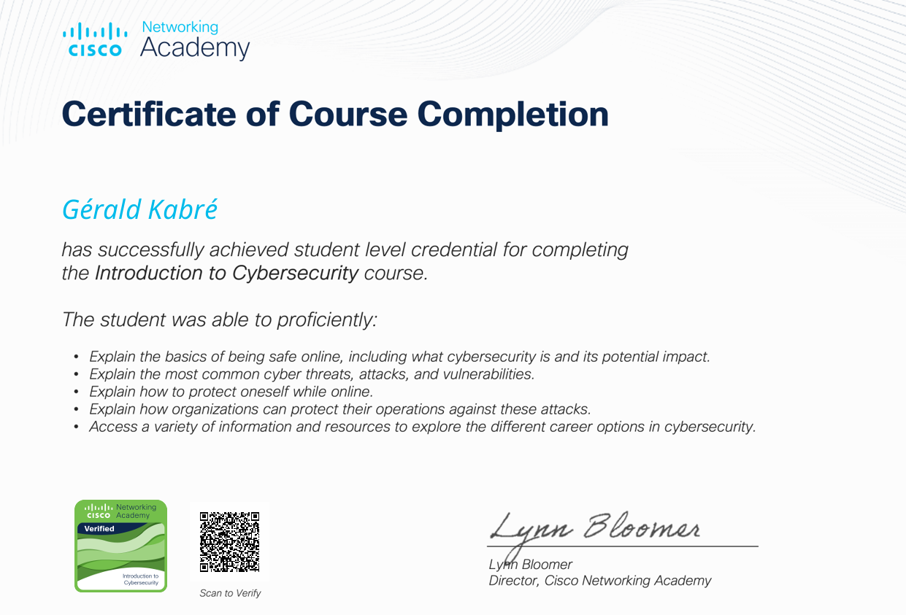
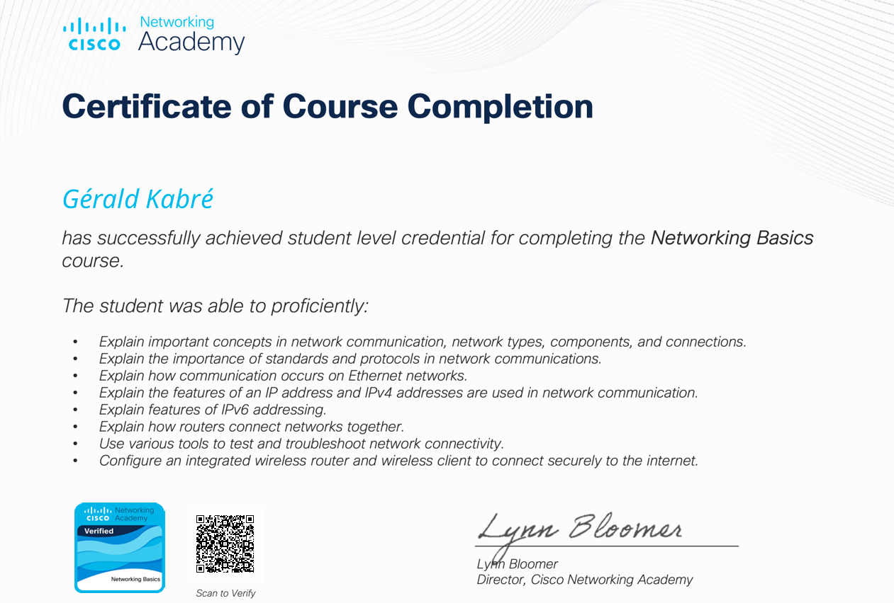
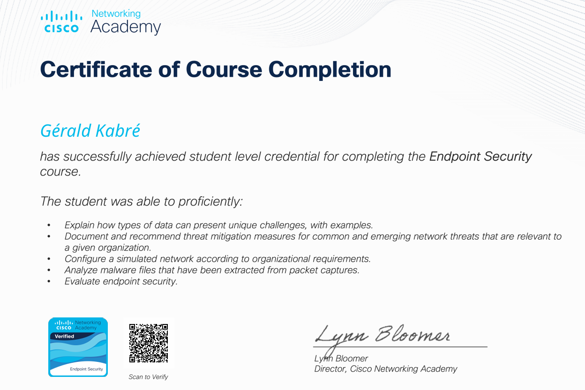
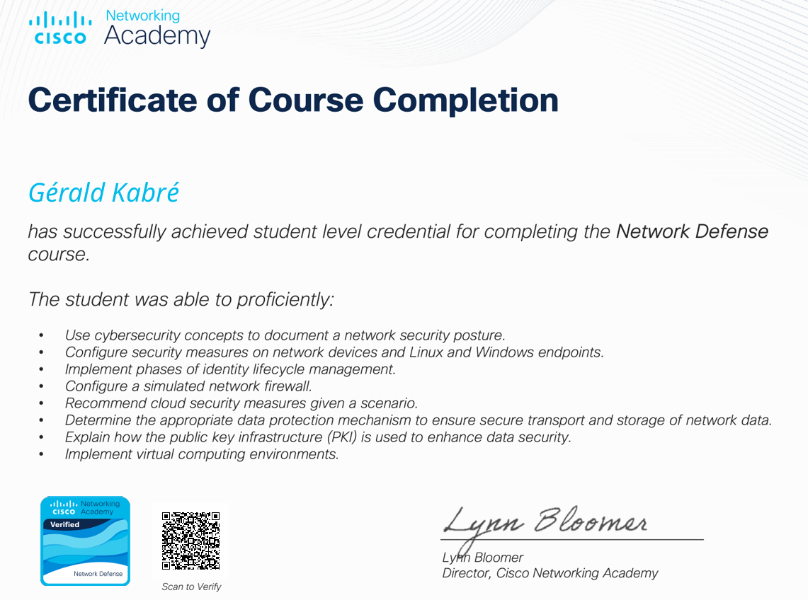
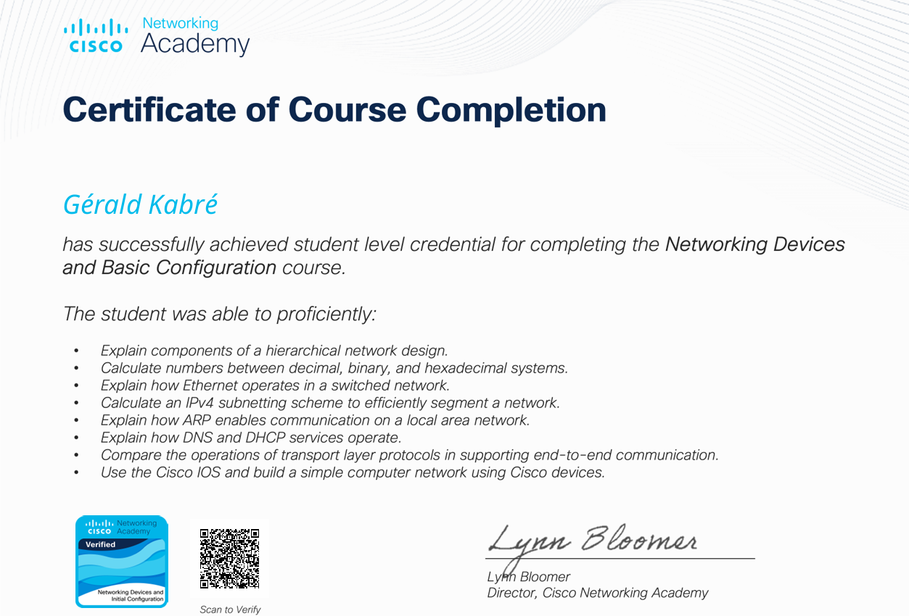

# 🛡 Certifications – Gérald Kabré

Voici un résumé de mes certifications Cisco et des compétences associées.

---

## 🛡 Parcours Analyste Junior en Cybersécurité – Cisco
🌍 J’ai choisi de me spécialiser dans la défense numérique grâce à la Cisco Networking Academy.  
🎓 Ce parcours, jalonné de certifications reconnues, m’a permis de développer une expertise opérationnelle directement applicable.

### ✨ Compétences clés acquises :
- 🔐 Sécurité réseau & gestion des risques
- 🛰 Veille et analyse des menaces (Threat Intelligence)
- 🛡 Détection & réponse aux incidents de sécurité
- ⚔ Méthodologie de mitigation et défense face aux cyberattaques

### 🚀 Métiers visés :
- 👨‍💻 Analyste SOC Junior
- 🛡 Technicien en cybersécurité
- 🖥 Support sécurité de premier niveau

---

## 🔐 Cisco – Introduction to Cybersecurity
  
✅ Compréhension des fondamentaux de la cybersécurité et bonnes pratiques organisationnelles.

## 🌐 Cisco – Networking Basics
  
✅ Maîtrise des réseaux, protocoles, configuration et sécurisation des équipements.

## 🖥 Cisco – Endpoint Security
  
✅ Protection et sécurisation des postes de travail et terminaux réseau.

## 🛡 Cisco – Network Defense
  
✅ Sécurisation des infrastructures réseau et systèmes d’exploitation.

## 🌐 Cisco – Networking Devices and Basic Configuration
  
✅ Conception et configuration de réseaux à l’aide d’équipements Cisco.

## ⚔ Cisco – Cyber Threat Management
  
✅ Identification, évaluation et gestion des menaces et vulnérabilités dans un contexte organisationnel.

